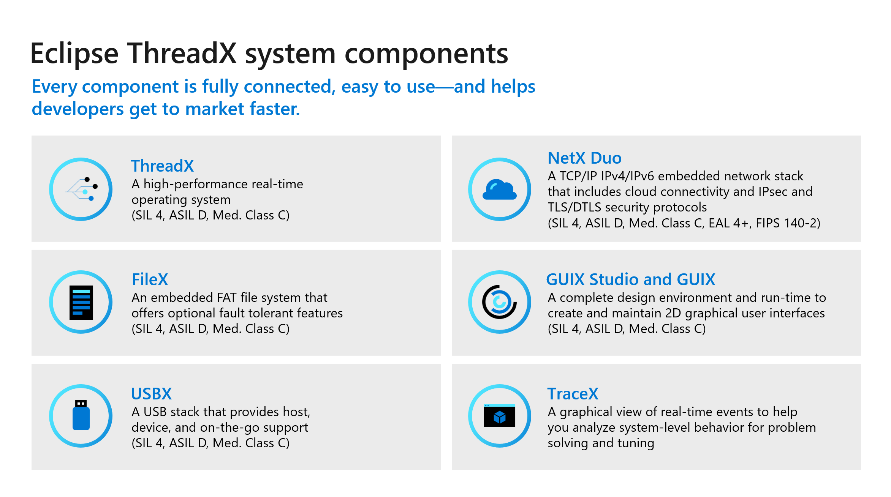
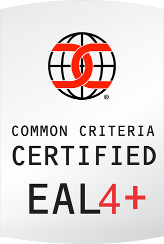

# About this repository
This is the AsciiDoc source for the Eclipse ThreadX documentation. The project team generates HTML and PDF versions from the contents of this repository. 

If you want to propse changes or addition to the documentation, this is the right place!

# What is Eclipse ThreadX?

Eclipse ThreadX is a real time operating system (RTOS) for Internet of Things (IoT) and edge devices powered by microcontroller units (MCUs). Eclipse ThreadX is designed to support most highly constrained devices (battery powered and having less than 64 KB of flash memory).

Eclipse ThreadX provides full IP layer security via IPsec and socket layer security via TLS and DTLS. Our software crypto library has achieved FIPS 140-2 certification. We also leverage hardware cryptographic capabilities, memory protection via ThreadX MODULES, and support for ARM's TrustZone ARMv8-M security features.

**IMPORTANT:** Microsoft Azure RTOS, an embedded development suite with the ThreadX real-time operating system, has been deployed on more than 12 billion devices worldwide. Azure RTOS has now transitioned to an open-source project under the stewardship of the Eclipse Foundation, a recognized leader in hosting open-source IoT projects.

With Eclipse Foundation as the new home, Azure RTOS becomes Eclipse ThreadX. For more information, see the following pages:

* [Microsoft IoT blog](https://techcommunity.microsoft.com/t5/internet-of-things-blog/microsoft-contributes-azure-rtos-to-open-source/ba-p/3986318)
* [Eclipse ThreadX project](https://threadx.io/)

## Eclipse ThreadX resources

[Eclipse ThreadX repositories](https://github.com/eclipse-threadx/)

Documentation for components:

- [ThreadX](./rtos-docs/threadx/index.md)
- [ThreadX Modules](./rtos-docs/threadx-modules/index.md)
- [NetX Duo](./rtos-docs/netx-duo/index.md)
- [GUIX](./rtos-docs/guix/index.md) 
- [FileX](./rtos-docs/filex/index.md)
- [LevelX](./rtos-docs/levelx/index.md)
- [USBX](./rtos-docs/usbx/index.md)
- [TraceX](./rtos-docs/tracex/index.md)

Other resources:

- [Product Support Policy](./rtos-docs/general/lts.md)
- [Security Updates](./rtos-docs/general/security-updates.md)

## Components of Eclipse ThreadX

The Eclipse ThreadX platform is the collection of run-time solutions including ThreadX, NetX Duo, FileX, GUIX and USBX.

### ThreadX

ThreadX is an advanced Real-Time Operating System (RTOS) designed specifically for deeply embedded applications. Among the multiple benefits ThreadX provides are advanced scheduling facilities, message passing, interrupt management, and messaging services. ThreadX has many advanced features, including its picokernel architecture, preemption-threshold scheduling, event-chaining, and a rich set of system services.

### FileX

FileX is a high-performance FAT-compatible file system. It is fully integrated with ThreadX and is available for all supported processors. Like ThreadX, FileX is designed to have a small footprint and high performance, making it ideal for today's deeply embedded applications that require file operations. FileX supports most physical media, including RAM disk, USBX, SD CARD, and NAND/NOR flash memories via LevelX.

### GUIX

GUIX is a professional quality graphical user interface package, created to meet the needs of embedded systems developers. Unlike the alternatives, GUIX is small, fast, and easily ported to virtually any hardware configuration capable of supporting graphical output. GUIX also delivers exceptional visual appeal and an intuitive and powerful API for application-level user interface development.

### NetX Duo

NetX Duo is an advanced, Industrial Grade TCP/IP network stacks designed specifically for deeply embedded, real-time, and IoT applications. NetX Duo is a dual IPv4 and IPv6 network stack.

### USBX

USBX is a high-performance USB host, device, and On-The-Go (OTG) embedded stack. It is fully integrated with ThreadX and is available for all ThreadX supported processors. Like ThreadX, USBX is designed to have a small footprint and high performance, making it ideal for deeply embedded applications that require an interface with USB devices.

### Windows tools

GUIX Studio provides a complete GUI application design environment, facilitating the creation and maintenance of all graphical elements in the application's GUI. GUIX Studio automatically generates C code compatible with the GUIX library, ready to be compiled and run on the target.

TraceX is a host-based analysis tool that provides developers with a graphical view of real-time system events and enables them to visualize and better understand the behavior of their real-time systems.

## The Eclipse ThreadX Advantage

Eclipse ThreadX provides the following advantages over other real-time operating systems.

### Most deployed RTOS

Eclipse ThreadX has over 12 billion deployments worldwide. The popularity of Eclipse ThreadX is a testament to its reliability, quality, size, performance, advanced features, ease-of-use, and overall time-to-market advantages.
> _"We have followed the growth trajectory of THREADX in the wireless and IoT markets since the company's founding, and are increasingly impressed by the widespread industry adoption of THREADX."_ – Chris Rommel, Executive Vice President, VDC Research

### Intuitive and consistent API design

- Intuitive and consistent API.
- Noun-verb naming convention.
- All APIs have leading prefix, such as \_tx\_\_ for ThreadX and \_fx\_\_ for FileX, to easily identify the Eclipse ThreadX component they belong to.
- Functional consistency throughout the APIs. For example, all API functions that suspend have an optional timeout that functions in an identical manner.
- Many APIs are directly available from application ISRs.
- Optional user-notification callbacks for media and file operations.
- Event-driven programming model (API).

### High efficiency

- Small code footprint.
- Scalable code footprint based on the services used.
- Fast execution. Eclipse ThreadX is designed for speed and has minimal internal function call layering to help achieve the fastest possible performance.

### Fastest time-to-market

Eclipse ThreadX is easy to install, learn, use, debug, verify, certify, and maintain. As a result, Eclipse ThreadX is one of the most popular real time operating systems for embedded IoT devices, including many SoCs from Broadcom, Gainspan, and so forth. Our consistent time-to-market advantage is built on:

- Complete source code availability.
- Easy-to-use API.
- Comprehensive and advanced feature set.
- Quality documentation.

### Full, highest-quality source code

Throughout the years, Eclipse ThreadX source code has set the bar in quality and ease of understanding. In addition, the convention of having one function per file provides for easy source navigation.

### Pre-certified by TÜV and UL to many safety standards

Eclipse ThreadX has been certified by SGS-TÜV Saar for use in safety-critical systems, according to IEC-61508 SIL 4. The certification confirms that Eclipse ThreadX can be used in the development of safety-related software for the highest safety integrity levels of IEC-61508 for the "Functional Safety of electrical, electronic, and programmable electronic safety-related systems." SGS-TUV Saar, formed through a joint venture of Germany's SGS-Group and TUV Saarland, has become the leading accredited, independent company for testing, auditing, verifying, and certifying embedded software for safety-related systems worldwide.

Eclipse ThreadX has been recognized by UL for compliance with UL 60730-1 Annex H, CSA E60730-1 Annex H, IEC 60730-1 Annex H, UL 60335-1 Annex R, IEC 60335-1 Annex R, and UL 1998 safety standards for software in programmable components. UL is a global, independent, safety-science company with more than a century of expertise innovating safety solutions, ranging from the public adoption of electricity to breakthroughs in sustainability, renewable energy, and nanotechnology.

Artifacts (Certificate, Safety Manual, Test Report, etc.) associated with the TUV and UL certifications are available to license.

In cases where the application needs additional certification, a certification service is available through Eclipse Foundation for providing turn-key certification to various standards using the actual hardware platform and even covering the application code. Contact us for more details on our certification service.

### EAL4+ Common Criteria security certification

ThreadX has achieved EAL4+ Common Criteria security certification. The Target of Evaluation (TOE) covers ThreadX, NetX Duo, NetX Secure TLS, and NetX MQTT. This represents the most typical IoT protocols required by deeply embedded sensors, devices, edge routers, and gateways.

The IT Security Evaluation Facility used for the Eclipse ThreadX SC security certification is Brightsight BV and the Certification Authority is SERTIT.

### FIPS 140-2 Validated

Eclipse ThreadX Crypto libraries have achieved Federal Information Processing Standardization 140-2 (FIPS 140-2) Certification for software, which specifies requirements for cryptography modules. FIPS 140-2 requires all federal government agencies and departments that use cryptographic-based security to meet specific standards related to encryption strength and capabilities. These cryptographic-based security standards are also recognized in Canada and the European Union.

The Information Security evaluation lab used for Eclipse ThreadX Crypto libraries was atsec and the certification authority is [The National Institute of Standards and Technology (NIST)](https://csrc.nist.gov/projects/cryptographic-module-validation-program/Certificate/3394).

### Supports most popular architectures

Eclipse ThreadX works on most popular 32/64-bit microprocessors, out-of-the-box, fully tested and fully supported, including the following advanced architectures:

- **Analog Devices**: SHARC, Blackfin, CM4xx

- **Andes Core**: RISC-V

- **Ambiqmicro**: Apollo MCUs

- **ARM**: ARM7, ARM9, ARM11, Cortex-M0/M3/M4/M7/A15/A5/A7/A8/A9/A5x 64-bi/A7x 64-bit/R4/R5, TrustZone ARMv8-M

- **Cadence**: Xtensa, Diamond

- **CEVA**: PSoC, PSoC 4, PSoC 5, PSoC 6, FM0+, FM3, MF4, WICED WiFi

- **Cypress**: RISC-V

- **EnSilica**: eSi-RISC

- **Infineon**: XMC1000, XMC4000, TriCore

- **Intel; Intel FPGA**: x36/Pentium, XScale, NIOS II, Cyclone, Arria 10

- **Microchip**: AVR32, ARM7, ARM9, Cortex-M3/M4/M7, SAM3/4/7/9/A/C/D/E/G/L/SV, PIC24/PIC32

- **Microsemi**: RISC-V

- **NXP**: i.MX RT10xx and RT116x/7x series crossover MCUs, LPC5500 series

- **Renesas**: SH, HS, V850, RA, RX, RZ, Synergy 

- **Silicon Labs**: EFM32

- **Synopsys**: ARC 600, 700, ARC EM, ARC HS

- **ST**: STM32, ARM7, ARM9, Cortex-M3/M4/M7

- **Tl**: C5xxx, C6xxx, Stellaris, Sitara, Tiva-C

- **Wave Computing**: MIPS32 4K, 24 K, 34 K, 1004 K, MIPS64 5K, microAptiv, interAptiv, proAptiv, M-Class

- **Xilinx**: MicroBlaze, PowerPC 405, ZYNQ, ZYNQ UltraSCALE

_All timing and size figures listed are estimates and may be different on your development platform._
